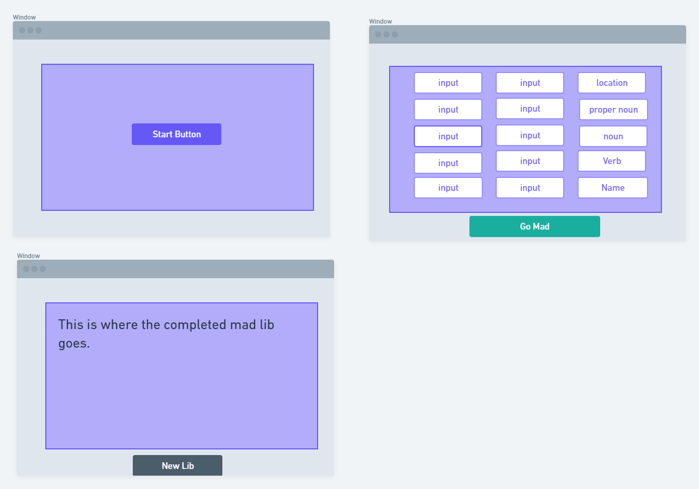

# MadLibGame
---
## Wireframe/Description

> A simple web-browser mad lib, by using a random API to retreive needed input and placing those into the story for the user. 
---
### Psuedocode
- //create a button to pull a madlib API, (possibly http://madlibz.herokuapp.com/api/random)
- //take information from api and create array from "blanks" field, store "value field" change title based on "title" field
- //use "blanks" array to display input boxes based on array length, with greyed text of their string
- //create button to take inputs from uses and replace the \n* field in the value strings and display the entire string
- // style final madlib
- //create a restart button under completed madlib
---
#### Stretch Goals
- add unique styles to display madlib
- integrate second API to auto-fil blank choices
- add a delayed laugh track
- dark/light mode
---
