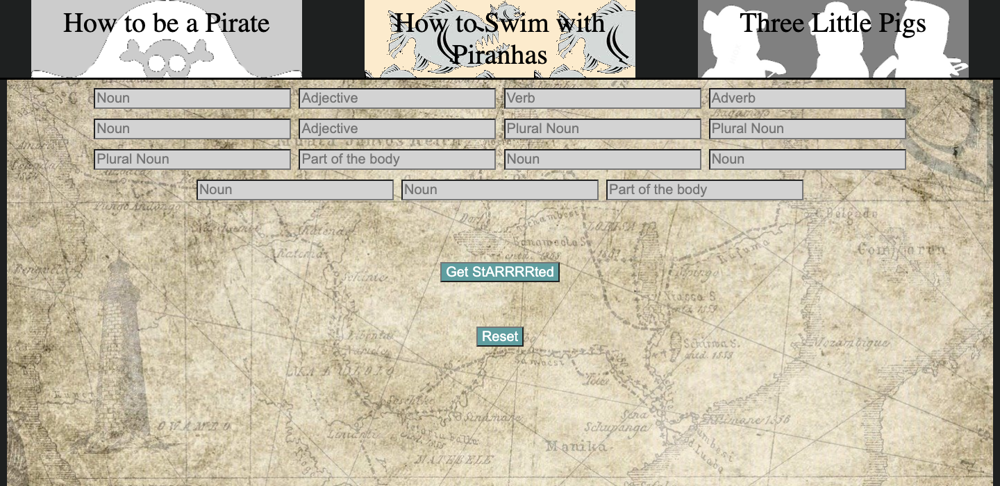
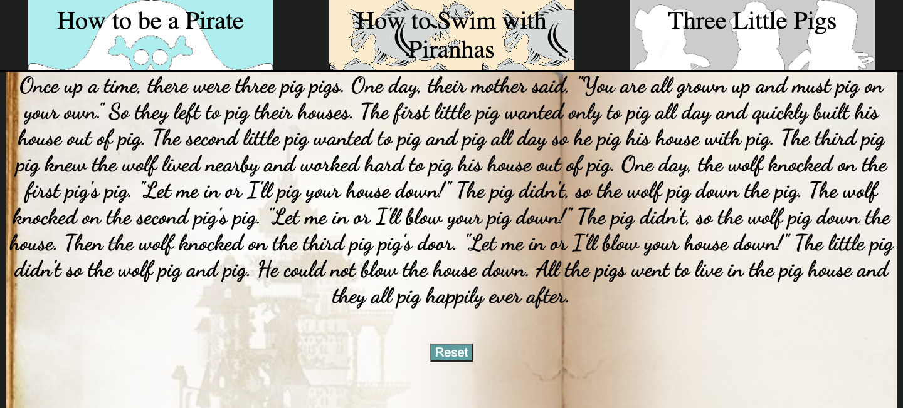

# MadLibGame
[Link]("project1-lampleyLibe.surge.sh")
---
## Wireframe/Description

> A simple web-browser mad lib, by using a input from user and placing those into a story for the user to read. 
---
### Psuedocode
- //create constants for inputs
- //take information from "blanks" field, store as "values"
- //create button to take inputs from uses and replace the blanks field with the value and display the entire string
- // style final madlib
- //create a restart button under completed madlib
---
#### Stretch Goals*
- [x] add unique styles to display madlib
- [ ] integrate API to auto-fil blank choices
- [ ] add a delayed laugh track
- [ ] dark/light mode
- [ ] full mobile functionality
---
##### User Stories
- Dave wants to input juvenile text strings to giggle at stories.
- Sandy wanted to have an easy to use way to make silly stories.
- Brett wants to replace every word blank with the word "butts", user believes this is the height of comedy.
---
###### Screenshots

